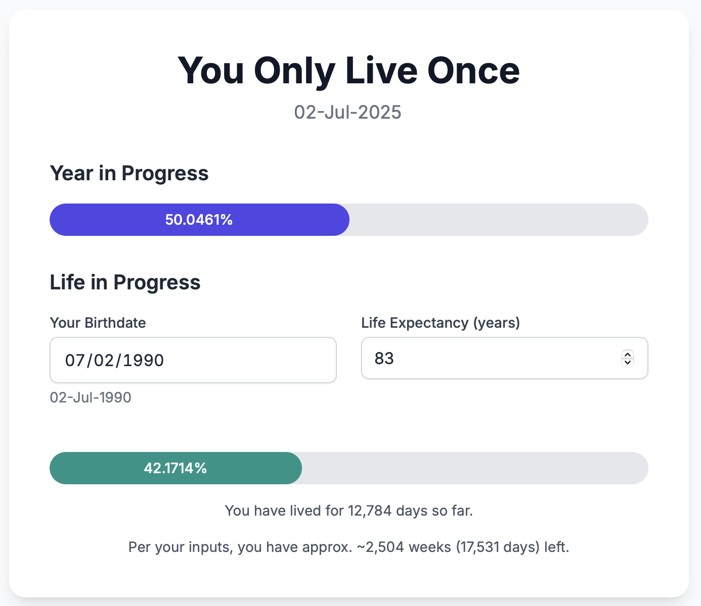

# You Only Live Once (YOLO)

A simple web application that visualizes your life progress and the current year's progress as interactive progress bars.



## Features

- **Year Progress**: Shows how much of the current year has passed
- **Life Progress**: Calculates and displays your life progress based on:
  - Your birthdate
  - Your life expectancy (customizable, defaults to 83 years)
- **Persistent Settings**: Your birthdate and life expectancy are saved in your browser's localStorage
- **Real-time Updates**: Year progress updates every minute
- **Responsive Design**: Works on desktop and mobile devices

## Usage

1. Open `index.html` in any modern web browser
2. Enter your birthdate using the date picker
3. Adjust your life expectancy if desired (defaults to 83 years based on this [article](https://www.channelnewsasia.com/singapore/life-expectancy-singapore-rises-2024-5154631)).
4. Your settings are automatically saved and will persist between sessions

## Technical Details

- Built with vanilla HTML, CSS, and JavaScript
- Uses Tailwind CSS for styling
- Inter font from Google Fonts
- Responsive design with mobile-first approach
- Data persistence using localStorage API

## File Structure

```
yolo/
├── README.md
└── yolo.html    # Main application file
```

## Browser Compatibility

Works in all modern browsers that support:
- ES6+ JavaScript features
- localStorage API
- CSS Grid and Flexbox
- HTML5 date input
